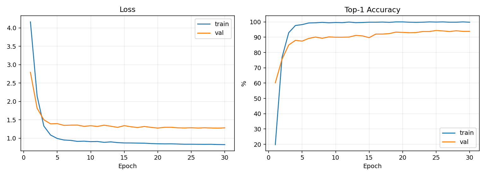
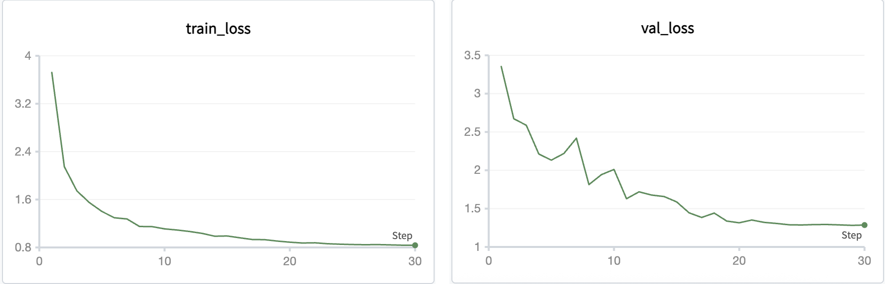
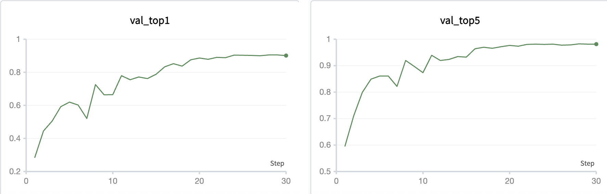

# Task 1 实验报告：Flowers102 图像分类

## 1. 实验内容

本次任务是在 102 Category Flower Dataset 上完成花卉图像分类。数据集一共有 102 个类别，训练集规模比较小，所以我主要采用在 ImageNet 上预训练过的 ResNet-18 作为 baseline，然后在此基础上做了三组对比实验：随机初始化训练、调整学习率和 batch size、加入 SE 注意力模块。最后用验证集和测试集的 Accuracy 来比较不同设置的效果。

## 2. 数据集与预处理

实验使用 `torchvision.datasets.Flowers102` 中提供的官方划分：

| Split | 数量 |
| --- | ---: |
| Train | 1020 |
| Validation | 1020 |
| Test | 6149 |

输入图像统一 resize/crop 到 `224 x 224`。训练阶段使用了 `RandomResizedCrop`、`RandomHorizontalFlip`、`ColorJitter` 和 `RandomErasing` 做数据增强；验证和测试阶段只做确定性的 resize/crop。归一化使用 ImageNet 的 mean/std，这样可以和 ImageNet 预训练权重保持一致。

## 3. 模型方法

Baseline 采用 ResNet-18。原模型最后的全连接层输出为 ImageNet 的 1000 类，我将其替换成输出 102 类的新分类层。训练时新分类层从随机初始化开始学习，backbone 使用 ImageNet 预训练参数，并设置比分类层更小的学习率进行微调。

为了比较预训练的作用，我另外训练了一个随机初始化的 ResNet-18，网络结构和训练设置基本保持一致。为了测试注意力机制是否有帮助，我还实现了 SE-ResNet18，在每个 BasicBlock 的残差分支中加入 SE block，让网络可以根据通道重要性重新调整特征。

## 4. 实验设置

| 实验 | 初始化 | batch size | backbone LR | head LR | optimizer | scheduler | iteration/epoch | total iteration | epoch | loss |
| --- | --- | ---: | ---: | ---: | --- | --- | ---: | ---: | ---: | --- |
| ResNet18 Pretrained | ImageNet | 32 | 1e-4 | 1e-3 | AdamW | CosineAnnealingLR | 32 | 960 | 30 | Cross-Entropy + Label Smoothing |
| ResNet18 Scratch | Random | 32 | 1e-3 | 1e-3 | AdamW | CosineAnnealingLR | 32 | 960 | 30 | Cross-Entropy + Label Smoothing |
| SE-ResNet18 Pretrained | ImageNet | 32 | 1e-4 | 1e-3 | AdamW | CosineAnnealingLR | 32 | 960 | 30 | Cross-Entropy + Label Smoothing |
| ResNet18 Pretrained HP | ImageNet | 64 | 3e-5 | 3e-4 | AdamW | CosineAnnealingLR | 16 | 480 | 30 | Cross-Entropy + Label Smoothing |

评价指标采用 Top-1 Accuracy、Top-5 Accuracy 和 loss。实验在本机 Apple Silicon 上运行，PyTorch 使用 MPS 后端。

## 5. 实验结果

| 实验 | Best Val Accuracy | Test Accuracy | Test Top-5 Accuracy | Best Epoch |
| --- | ---: | ---: | ---: | ---: |
| ResNet18 Pretrained | 94.41% | 90.93% | 97.33% | 25 |
| ResNet18 Scratch | 46.76% | 41.18% | 70.74% | 29 |
| SE-ResNet18 Pretrained | 93.14% | 89.19% | 97.02% | 27 |
| Hyperparameter Variant | 91.37% | 88.11% | 96.84% | 30 |

从结果看，ImageNet 预训练的 ResNet18 表现最好，测试集 Top-1 Accuracy 达到 90.93%。随机初始化模型的测试准确率只有 41.18%，说明在 Flowers102 这种训练集较小的数据集上，预训练特征非常重要。SE-ResNet18 的结果比随机初始化模型好很多，但略低于 baseline，说明这次加入 SE block 没有带来额外提升。

Baseline 本地训练曲线如下：

SwanLab 中记录的 loss 曲线如下，其中包括训练集 loss 和验证集 loss：

SwanLab 中记录的验证集 Accuracy 曲线如下，其中包括 `val_top1` 和 `val_top5`：

## 6. 实验分析

### 6.1 超参数影响

我主要比较了两组预训练 ResNet18 设置。baseline 使用 batch size 32、分类头学习率 1e-3、backbone 学习率 1e-4，最终测试准确率为 90.93%。另一组超参数实验把 batch size 增大到 64，同时把分类头和 backbone 的学习率分别降到 3e-4 和 3e-5，测试准确率下降到 88.11%。从这组结果看，当前任务中较小 batch size 和较大的分类头学习率更适合快速适配 Flowers102 数据集。

### 6.2 预训练消融

预训练模型和随机初始化模型的差距很明显。ResNet18 Pretrained 的测试 Top-1 Accuracy 是 90.93%，而 ResNet18 Scratch 只有 41.18%。我认为主要原因是 Flowers102 的训练集每类样本数量很少，如果从零开始训练，模型很难学到稳定的低层和中层视觉特征；使用 ImageNet 预训练后，网络已经具备较好的通用图像表征能力，只需要在花卉分类任务上微调即可。

### 6.3 注意力机制

SE-ResNet18 的测试 Top-1 Accuracy 是 89.19%，略低于普通 ResNet18 baseline。这个结果说明注意力模块不一定总能提升性能，特别是在数据量较小、训练轮数有限的情况下，新增模块可能会增加优化难度。后续如果继续改进，可以尝试更长训练、更细的学习率搜索，或者比较 CBAM、ViT-Tiny 等其他结构。

## 7. 代码与模型权重

- GitHub 仓库：[https://github.com/pesenteur/hw2.git](https://github.com/pesenteur/hw2.git)
- 模型权重：[Google Drive 下载链接](https://drive.google.com/file/d/1XR98f6fDGAXG2g9CKBrVLxt7xh-hWrS9/view?usp=drive_link)
- 本地最佳权重路径：`checkpoints/task1/resnet18_pretrained_lr1e-3_bs32/best.pt`

